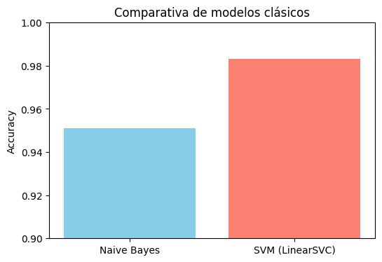
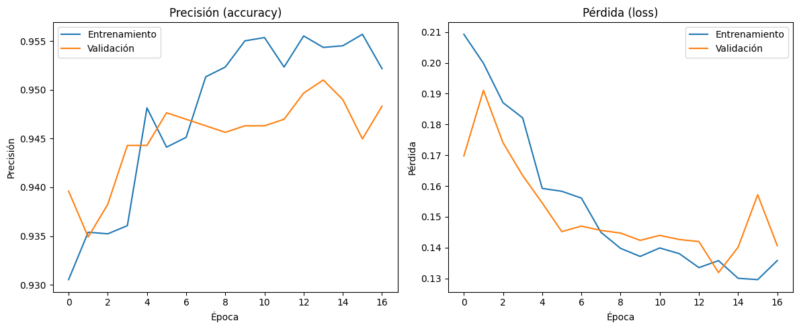
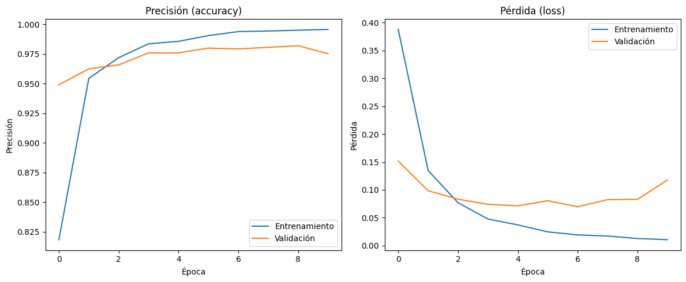

# Filtro de Spam Multilingüe

[](https://www.python.org/)
[](https://fastapi.tiangolo.com/)
[](https://huggingface.co/)

Proyecto personal para la detección de spam en múltiples idiomas, combinando modelos clásicos, redes neuronales y modelos preentrenados de Hugging Face, con pipeline multilingüe y API lista para producción.

---

## Índice
- [Descripción](#descripción)
- [Estructura del Proyecto](#estructura-del-proyecto)
- [Instalación](#instalación)
- [Uso del Notebook](#uso-del-notebook)
- [API FastAPI Multilingüe](#api-fastapi-multilingüe)
- [Ejemplo de Uso](#ejemplo-de-uso)
- [Comparativa de Modelos](#comparativa-de-modelos)
- [Pruebas Unitarias](#pruebas-unitarias)
- [Resultados y Conclusiones](#resultados-y-conclusiones)
- [Despliegue y buenas prácticas](#despliegue-y-buenas-prácticas)
- [Contacto](#contacto)

---

## Descripción
Este proyecto implementa un filtro de spam robusto y reproducible, capaz de:
- Detectar el idioma de entrada y traducir automáticamente a inglés si es necesario.
- Clasificar emails y SMS como spam o no spam usando:
  - Modelos clásicos (Naive Bayes, SVM)
  - Redes neuronales (MLP, LSTM, CNN)
  - Modelos preentrenados (BERT fine-tuned para emails)
- Integrar todo en una API profesional y multilingüe (FastAPI).

Ideal para portfolio, entrevistas técnicas y como base para despliegue real.

---

## Estructura del Proyecto
```text
Filtro_Spam/
├── data/           # Datasets y embeddings (no incluidos en el repo)
├── notebooks/      # Jupyter notebooks con experimentos y demo
├── src/            # Código fuente de la API y utilidades
├── tests/          # Pruebas unitarias
├── requirements.txt# Dependencias
├── README.md       # Este documento
```

---

## Instalación
1. Clona el repositorio:
   ```bash
   git clone https://github.com/tu_usuario/multilingual-spam-filter.git
   cd multilingual-spam-filter
   ```
2. Instala las dependencias:
   ```bash
   pip install -r requirements.txt
   ```
3. Descarga los datasets y embeddings indicados en el notebook (no se incluyen por tamaño).

---

## Uso del Notebook
- Abre `notebooks/Spam_Filtre.ipynb` para reproducir el pipeline completo.
- Incluye preprocesamiento, entrenamiento, comparación de modelos y visualización de resultados.

---

## API FastAPI Multilingüe
Puedes lanzar la API localmente con:
```bash
uvicorn src.api_spam_multilingual:app --reload
```
Accede a la documentación interactiva en [http://127.0.0.1:8000/docs](http://127.0.0.1:8000/docs)

### Ejemplo de petición desde Python
```python
import requests

data = {"text": "¡Felicidades! Has ganado un iPhone gratis. Haz clic aquí para reclamar tu premio."}
response = requests.post("http://127.0.0.1:8000/predict", json=data)
print(response.json())
```

### Ejemplo de petición desde terminal
```bash
curl -X POST "http://127.0.0.1:8000/predict" -H "Content-Type: application/json" -d '{"text": "Vous avez été sélectionné pour une récompense en espèces. Répondez maintenant!"}'
```

---

## Comparativa de Modelos

| Modelo        | Accuracy | Precision | Recall | F1-score |
|--------------|----------|-----------|--------|----------|
| Naive Bayes  |   ...    |    ...    |  ...   |   ...    |
| SVM          |   ...    |    ...    |  ...   |   ...    |
| LSTM         |   ...    |    ...    |  ...   |   ...    |
| CNN 1D       |   ...    |    ...    |  ...   |   ...    |
| BERT-email   |   ...    |    ...    |  ...   |   ...    |

_(Actualizar resultados)_

### Visualización de resultados

#### Comparativa de modelos clásicos



#### Métricas del modelo LSTM



#### Métricas del modelo CNN 1D



---

## Pruebas Unitarias
Lanza todos los tests con:
```bash
pytest tests/
```
Incluye tests para:
- Preprocesamiento y traducción
- API `/predict` (multilingüe y robusta)

---

## Resultados y Conclusiones
- El pipeline multilingüe y la integración de modelos preentrenados permiten un filtrado de spam robusto y moderno.
- La API es fácilmente integrable y lista para producción.
- El uso de modelos preentrenados es el estándar actual en la industria y la investigación NLP.
- El proyecto es fácilmente extensible (más idiomas, otros modelos, despliegue cloud, etc.)

---

## Despliegue y buenas prácticas
- El código está preparado para despliegue local y cloud (Render, Railway, Hugging Face Spaces, AWS, etc.).
- `.gitignore` profesional para evitar archivos pesados en el repo.
- Documentación y ejemplos claros.
- Manejo de errores robusto en la API.

---

## Próximamente: Dashboard interactivo

> 🚀 **En desarrollo:** Este proyecto contará próximamente con un dashboard interactivo en Streamlit para probar el filtro de spam de forma visual e intuitiva. ¡Permanece atento!

---

## Contacto
- **GitHub:** [Alex G.Herrera](https://github.com/tu_usuario)
- **LinkedIn:** [Alex G.Herrera](https://github.com/AlexGHerrera)
